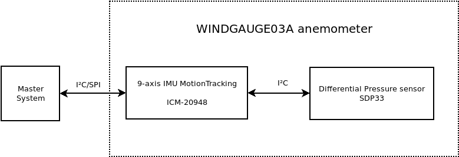

<!--- PrjInfo ---> <!--- Please remove this line after manually editing --->
<!--- 00a56be08b96043df9e37d6aff7b6990 --->
<!--- Created:2019-04-25 18:04:07.487886: ---> 
<!--- Author:: ---> 
<!--- AuthorEmail:: ---> 
<!--- Tags:: ---> 
<!--- Ust:: ---> 
<!--- Label --->
<!--- ELabel ---> 
<!--- Name:WINDGAUGE03A: --->
# WINDGAUGE03A
<!--- LongName --->
## Venturi tube based anemometer
<!--- ELongName ---> 

<!--- Lead --->
High-endurance venturi anemometer with minimum moving parts. 
<!--- ELead ---> 

<!--- Description --->

 

### Advantages
  * Minimised number of moving parts results in increased durability
  * Venturi effect allows accurate measurement in wide range of speeds. 

### Function principle

The anemometer consists the IMU sensor ICM-20948 which contains magnetometer, gyroscopes and accelerometers. The IMU allows sophisticated data aquisition for failure detection and gust wind analysis. 

 

### Main parameters
  
  * Absolute azimuth accuracy 1°
  * Wind speed measurement range 0-120 km/h
  * Maximum mechanically safe wind speed 150 km/h
  * Communication interfaces: 
    * USB
    * I²C
  * Operational temperature range -20/+45 °C
  * Maximum hail diameter 0.5 cm 

<!--- EDescription --->
<!--- Content --->
<!--- EContent --->
 Generated with [MLABweb](https://github.com/MLAB-project/MLABweb). (2019-04-25)
